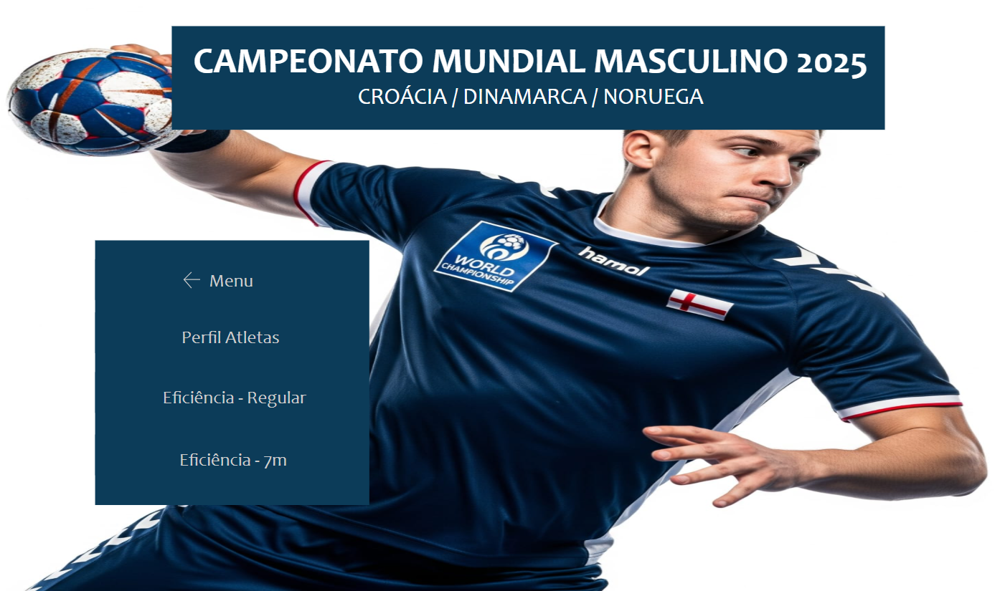

#  Análise do Perfil dos Atletas do Campeonato Mundial Masculino 2025

---
*Base de dados:* IHF Handball World Champioship 2025 Goalscorers
*Sobre o dataset:* Este conjunto de dados detalha o perfil e o desempenho de jogadores de handebol, organizados por suas posições no time. 
Inclui informações físicas (peso, altura, idade) e estatísticas de arremesso (gols, tentativas e eficiência) tanto em jogo corrido quanto em cobranças de 7 metros.

# Objetivo
Compreender as características e o desempenho de cada posição no handebol. Identificar o que torna cada jogador único e aproveitar esses dados para aprimorar as táticas da equipe e o desempenho individual.

# Ferramentas Utilizadas
* Power BI
* Power Query

# Principais Etapas
Utilizei o método ETL para tratamento dos dados.

## 1. Extração (Extract)
Fonte de dados: Base obtida do Kaggle (em inglês).

Ações realizadas:
* Importação do dataset original
* Verificação inicial da estrutura, qualidade e tipo dos dados

## 2. Transformação (Transform)
Padronização de dados:
Tradução de colunas (inglês → português) usando Replace Values
Ajuste de tipos de dados

## 3. Carregamento (Load)
Modelagem no Power BI:

Criação de novas colunas:
* Difereciando colunas e extraindo novas medidas para criação de colunas para melhor detalhamento do dataset.
* Criação de Medidas Calculadas: Utilizei bastante da função COUNT, AVERAGE, FILTER, SWITCH entre outras.

# Visualização e Insights

Dashboard:
* Gráficos de Treemap: Top EficiÊncia
* Cartões: Média das Variáveis

# Resultados Obtidos

A eficiência geral das goleiras no torneio está em 32,43%, indicando a média de desempenho. As métricas de "Eficiência (%)" 
e "Defesas" focam no desempenho individual dessas atletas, e a coluna "Principal" serve para identificar as goleiras que foram titulares ou tiveram maior tempo de jogo.

## Perfil Físico: A Base da Performance Atlética

A dimensão física dos atletas é um fator crucial, e a análise das médias de peso, altura e idade por posição revela padrões distintos:

* Dominância Física no Eixo Central: Posições como "Pivot", "Left Back" e "Right Back" se destacam por ter os atletas mais robustos, com as maiores médias de peso e altura. Esse perfil é consistente com as exigências táticas dessas funções, que frequentemente envolvem disputas por espaço, arremessos de potência e atuação em zonas de contato direto.
Agilidade e Versatilidade nas Pontas: Em contraste, as "Wings" (Left e Right) e o "Centre Back" apresentam médias ligeiramente menores em peso e altura. Essa característica física é fundamental para a agilidade, velocidade e mobilidade necessárias em suas posições, seja para infiltrações ou para a orquestração do ataque.
Experiência Equilibrada: A idade média geral de 27 anos, com pouca variação entre as posições, sugere um elenco com experiência consolidada. Essa maturidade tática e a capacidade de tomar decisões sob pressão são vitais para o desempenho da equipe.

## Eficiência nos Arremessos de 7 Metros: A Execução
  
O desempenho nos arremessos de 7 metros reflete a frieza e a precisão sob alta pressão.

* Excelência Geral nos 7m: A equipe demonstra uma impressionante eficiência média de 80% na conversão de arremessos de 7 metros, um diferencial importante em partidas equilibradas.
Especialistas em Precisão: "Centre Back" e "Right Back" se sobressaem com a maior eficiência (86%), indicando que, apesar de um volume menor de cobranças, sua precisão é excepcional. Isso pode sugerir que são designados para as cobranças mais cruciais.

* O Executor Principal: O "Right Wing" se destaca no volume de arremessos e gols, posicionando-o como o principal cobrador de 7 metros da equipe. Embora sua eficiência seja ligeiramente inferior (76%), seu papel central na execução é inegável.
Oportunidade de Melhoria: O "Left Back" apresenta a menor eficiência em 7 metros (72%), sinalizando uma área potencial para treinamento e aprimoramento específico.

## Desempenho no Jogo Regular: A Essência do Ataque

* Complexidade do Jogo Regular: A eficiência média geral de 67% é, como esperado, inferior à dos 7 metros. Isso ressalta a maior complexidade de finalizar sob pressão defensiva, em movimento e de diferentes distâncias.
Pilares Ofensivos: "Left Back" e "Right Back" são os maiores geradores de volume ofensivo, com o maior número de arremessos e gols. Apesar de sua eficiência ser a menor, sua função como arremessadores de média/longa distância sob marcação pesada justifica esse padrão. Eles são, de fato, os "artilheiros" da equipe em termos de volume.
Eficácia Próxima ao Gol: "Pivot" e "Right Wing" demonstram a maior eficiência (76%) em arremessos de jogo regular. Para o "Pivot", isso é compreensível dada sua proximidade com o gol e oportunidades de finalização mais claras. Para o "Right Wing", indica alta capacidade de conversão em suas zonas de atuação.
Balanceamento do Left Wing: O "Left Wing" apresenta um excelente equilíbrio, com alto volume de gols e arremessos, e uma eficiência de 70%, mostrando sua versatilidade e capacidade de finalizar tanto em transição quanto em ataque posicional.

## Conclusão Integrada e Recomendações

A análise conjunta dos dados traça um perfil coeso da equipe, onde cada posição contribui de forma distinta para o desempenho global:

* Força e Alcance nos Laterais: Os "Backs" (Left e Right) são a principal fonte de arremessos e gols no jogo regular, compensando uma eficiência ligeiramente menor com volume e poder. Sua robustez física é um diferencial.
* Agilidade e Oportunismo nas Pontas: Os "Wings" (Left e Right) são cruciais para a velocidade e finalização em situações de transição e jogadas pelos extremos. O "Right Wing" se destaca como o especialista em 7 metros, enquanto o "Left Wing" é uma ameaça constante em jogo corrido.
* Precisão e Organização Central: O "Centre Back" é o maestro do ataque, demonstrando precisão crucial em 7 metros e uma boa capacidade de finalização no jogo regular, além de um perfil físico que favorece a agilidade na distribuição. O "Pivot" é o finalizador de excelência próximo ao gol, convertendo as oportunidades geradas.

[Dashboard](https://app.powerbi.com/view?r=eyJrIjoiZjY2MTY1YTktNDU4ZC00ODExLTk2ZjAtM2E4NGQ1MDU1ZGQwIiwidCI6ImE5MWY1ZjM3LThmMzMtNDNlMi04MGJhLThkNzQ5YTVkZWQ1MSJ9)

[Home](https://tamirisguerreiro.github.io/site)
